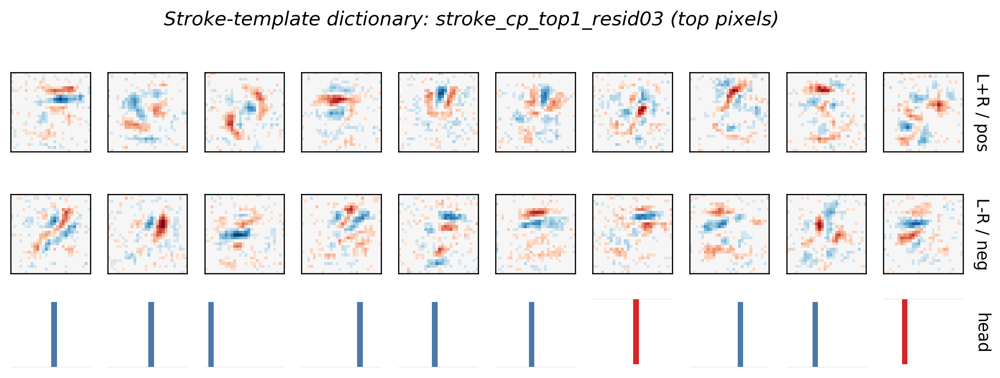

# Tensor Decomposition Experiments

This is my extended solution for the MARS V applicant task on decomposing MNIST bilinear weights into human concepts. I treated the assignment as a small research loop: reproduce the provided decomposition, define faithfulness/readability metrics, try several priors, and keep the strongest visual and quantitative results.

The short version: plain tensor reconstruction gives high fidelity but noisy components. Adding human-facing priors creates a clear Pareto frontier. The best visual result has very clean, one-class heads and localized components; the best balanced result uses a stroke-template dictionary and keeps one-hot heads while recovering substantially more tensor fidelity.

## How I Thought About The Task

The assignment prompt says there is no single right decomposition; the important
part is finding priors or structure that make the decomposition more
interpretable than per-class eigendecomposition. I used that as the organizing
principle.

My working hypothesis was:

> A good decomposition should not only reconstruct the interaction tensor. It
> should expose reusable pieces of digit evidence: bars, hooks, loops, gaps, and
> counter-strokes that affect a small number of classes.

That led me to separate three objectives that are often conflated:

1. **Faithfulness:** does the decomposed model preserve the original tensor and
   predictions?
2. **Compression:** can a small number of shared components explain multiple
   digits?
3. **Human readability:** do the components look like concepts rather than
   arbitrary low-rank factors?

Early runs showed that optimizing tensor cosine alone mostly solves
faithfulness, but not readability. The rest of the work is an attempt to add
increasingly explicit human priors while measuring the cost in fidelity.

The strongest priors were:

- hard class-head sparsity, because a component with a dense head is hard to
  name
- locality masks, because MNIST evidence is usually a local stroke or gap
- logit distillation, because tensor cosine can reward irrelevant tensor mass
- stroke-template initialization, because smoothness alone does not create
  human concepts

The main lesson is that interpretability here is a Pareto problem, not a single
metric. The best-looking explanation and the most faithful explanation are not
the same object.

## Files To Read

- `0_decomposition.ipynb` - executed notebook with the main decomposition experiments
- `decomposition_plan.md` - initial research plan
- `search_results_and_next_plan.md` - detailed experiment log and next-step reasoning
- `scripts/search_decompositions.py` - first broad search over CP/symmetric/evidence-split variants
- `scripts/search_visual_priors.py` - stronger visual-prior search with masks, hard heads, and distillation
- `scripts/search_stroke_templates.py` - human stroke-template dictionary experiment
- `figures/` - exported figures and CSV metric tables

I also added a minimal local `image/` package because the helper source imported by the notebooks was not present in the provided directory.

## Assignment Checklist

The original prompt asks for a concise report with screenshots of experiments
and thoughts/conclusions. This repo covers that as follows:

- **Read/setup tutorials:** `0_introduction.ipynb` and `1_image.ipynb` were used
  to ground the interaction-tensor and eigendecomposition framing.
- **Implement tensor decompositions:** `0_decomposition.ipynb` and the scripts
  implement CP, symmetric, evidence-split, visual-prior, and stroke-template
  decompositions.
- **Try priors/structure:** sparsity, smoothness, hard class heads, localized
  masks, distillation, eigen seeding, nonnegative factors, and stroke templates.
- **Screenshots/visuals:** key exported figures are embedded below, with more in
  `figures/`.
- **Thoughts/conclusions:** this README and `search_results_and_next_plan.md`
  summarize what worked, what failed, and why.
- **Code links:** scripts are included, but the README is written so the main
  conclusions are visible without reading all code.

## Main Question

The trained bilinear MNIST model computes logits from an interaction tensor:

```text
logit_c(x) = sum_ij B[c, i, j] x_i x_j
```

The baseline decomposition approximates the full tensor with shared components:

```text
B[c, i, j] ~= sum_r L[i, r] R[j, r] D[c, r]
```

The goal is not just reconstruction. A useful decomposition should be:

- faithful to the original model
- short and reusable across classes
- visually interpretable as strokes, edges, loops, or counter-evidence
- class-selective enough that the component head is easy to understand
- stable enough not to be just an optimizer artifact

## Strongest Result For Visual Interpretability

The cleanest visual result came from `mask034_cp_top1_distill`, which uses:

- CP-style factors
- fixed localized Gaussian masks
- raw-factor smoothness penalties
- logit distillation against the original model
- hard top-1 class heads
- visual-first component ranking


Metrics:

| Metric | Value |
|---|---:|
| tensor cosine | `0.6546` |
| decomposed test accuracy | `95.2%` |
| pattern gini | `0.6970` |
| 7x7 locality | `0.5084` |
| class selectivity | `1.0000` |
| top-1 head mass | `1.0000` |

This beats the prompt example on measured head clarity and locality: every displayed component has a one-class head, and the image patterns are much more spatially concentrated than the unconstrained decompositions. The cost is lower tensor cosine, so I would present it as the best visual explanation, not the most faithful decomposition.

## Best Balanced Result

The best balance came from the stroke-template dictionary, `stroke_cp_top1_resid03`. Here I initialized components from human stroke templates, then allowed a small smooth residual and learned amplitudes/class heads.

The template bank includes:

- horizontal bars
- vertical bars
- diagonals
- arcs
- loops
- endpoint/corner blobs



Metrics:

| Metric | Value |
|---|---:|
| tensor cosine | `0.8424` |
| decomposed test accuracy | `96.3%` |
| pattern gini | `0.4704` |
| 7x7 locality | `0.2931` |
| class selectivity | `1.0000` |
| top-1 head mass | `1.0000` |

This is the result I would emphasize as the most promising research direction. It preserves one-hot class heads and good accuracy while recovering much more tensor fidelity than the extreme mask-only visual result. It also directly tests the hypothesis that the model can be described in terms of reusable human stroke primitives.

## Highest-Fidelity Result

The highest-fidelity run was `cp_soft_sym_l1tv` from the broader search.

| Metric | Value |
|---|---:|
| tensor cosine | `0.9497` |
| decomposed test accuracy | `97.1%` |

This is useful as a control: the tensor can be reconstructed very well, but the resulting components are visually noisier and less immediately interpretable. This made the core tradeoff clear: reconstruction alone is not enough.

## What I Tried

### 1. Provided Sparse Baseline

I first reproduced the provided `image.sparse.Model` style CP decomposition. In the executed balanced notebook run, the baseline reached:

- tensor cosine: `0.8589`
- decomposed accuracy: `94.9%`

It was a solid starting point but visually mixed multiple strokes per component.

### 2. CP, Symmetric, And Evidence-Split Variants

I tested:

- CP factors with soft symmetry
- strictly symmetric factors, `L = R`
- positive/negative evidence split factors
- sparse and smooth variants
- nonnegative stroke variants
- eigenvector-seeded symmetric dictionaries

The best early result was `evidence split sparse smooth r32`:

- tensor cosine: `0.8770`
- decomposed accuracy: `95.5%`

The strictly symmetric variants were conceptually clean but underfit. The nonnegative-only factors were a useful negative result: they looked constrained but did not fit the model.

### 3. Heavier Rank-64 Search

I then increased capacity and optimization time. The best high-fidelity result was:

- `cp_soft_sym_l1tv`
- tensor cosine: `0.9497`
- decomposed accuracy: `97.1%`

This showed that fidelity was not the main blocker. The remaining problem was human readability.

### 4. Strong Visual Priors

I added:

- raw-factor smoothness and Laplacian penalties
- logit distillation on MNIST examples
- hard top-k class heads
- localized Gaussian masks
- visual ranking by locality, sparsity, head selectivity, and component strength

This produced the cleanest visual result, `mask034_cp_top1_distill`, with one-hot heads and strong locality.

### 5. Stroke-Template Dictionary

Finally, I changed the dictionary family instead of only increasing regularization. Components were initialized from explicit stroke templates and given small smooth residuals. This produced the best balanced result: `stroke_cp_top1_resid03`.

## Summary Table

| Approach | Tensor cosine | Accuracy | Why it matters | Weakness |
|---|---:|---:|---|---|
| Provided sparse baseline | `0.8589` | `94.9%` | starting point from task skeleton | mixed/noisy components |
| Evidence split sparse/smooth | `0.8770` | `95.5%` | better shared decomposition | still visually noisy |
| CP soft symmetry rank-64 | `0.9497` | `97.1%` | highest fidelity | poor readability |
| Extreme localized top-1 masks | `0.6546` | `95.2%` | cleanest visual heads/locality | lower tensor cosine |
| Stroke-template dictionary | `0.8424` | `96.3%` | best interpretability/fidelity compromise | less local than tight masks |

## Interpretation

The main finding is a Pareto frontier. If we optimize only tensor reconstruction, we get high-fidelity but visually superposed features. If we force locality and one-class heads, we get much clearer components while preserving surprisingly good classification accuracy. The stroke-template dictionary is the most interesting middle ground because it encodes an explicit human prior without collapsing accuracy.

This is the direction I would keep pursuing with a MARS mentor or at Goodfire: use weight-level decompositions, but give the dictionary enough structure that the discovered components can become actual concepts rather than arbitrary low-rank factors.

## Reproducing

Use Python 3.11. The default Python on this machine was 3.14, which was too new for the PyTorch stack, so I used a local venv.

```bash
python3.11 -m venv .venv
.venv/bin/python -m pip install -r requirements.txt
```

Execute the notebook:

```bash
PYTORCH_ENABLE_MPS_FALLBACK=1 RUN_PROFILE=balanced \
  .venv/bin/jupyter nbconvert --to notebook --execute 0_decomposition.ipynb \
  --output 0_decomposition.executed.ipynb --ExecutePreprocessor.timeout=3600
```

Run the stronger searches:

```bash
PYTORCH_ENABLE_MPS_FALLBACK=1 .venv/bin/python scripts/search_visual_priors.py \
  --epochs 10 --steps 320 --rank 64

PYTORCH_ENABLE_MPS_FALLBACK=1 .venv/bin/python scripts/search_visual_priors.py \
  --epochs 10 --steps 260 --rank 64 --outdir figures/visual_priors_extreme

PYTORCH_ENABLE_MPS_FALLBACK=1 .venv/bin/python scripts/search_stroke_templates.py \
  --epochs 10 --steps 360 --rank 72
```

The CSV outputs in `figures/` contain the full metric tables.

## Next Steps

The next best experiment is to combine the two strongest ideas:

1. Start from stroke templates.
2. Add learnable localized masks instead of fixed masks.
3. Keep hard top-1/top-2 class heads.
4. Add a small high-fidelity residual dictionary.
5. Match components across random seeds and only report recurring concepts.

That should improve semantic stroke quality without giving up the class-head clarity that made the visual-prior runs compelling.
