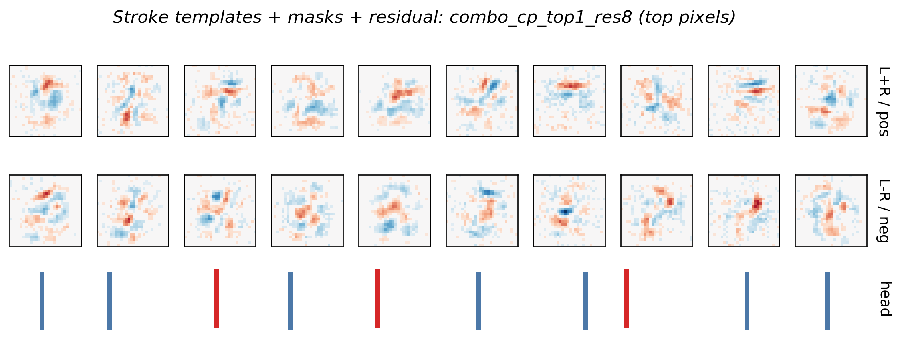
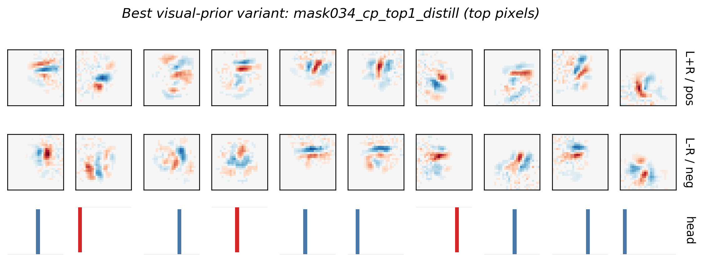
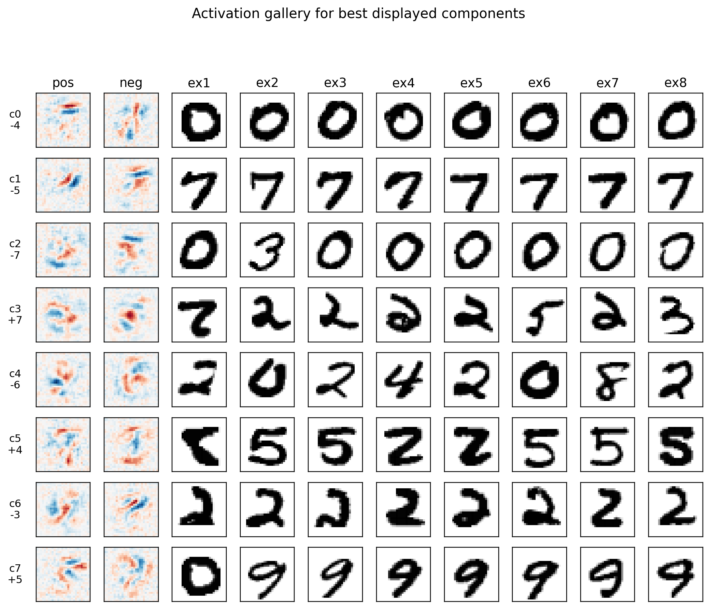
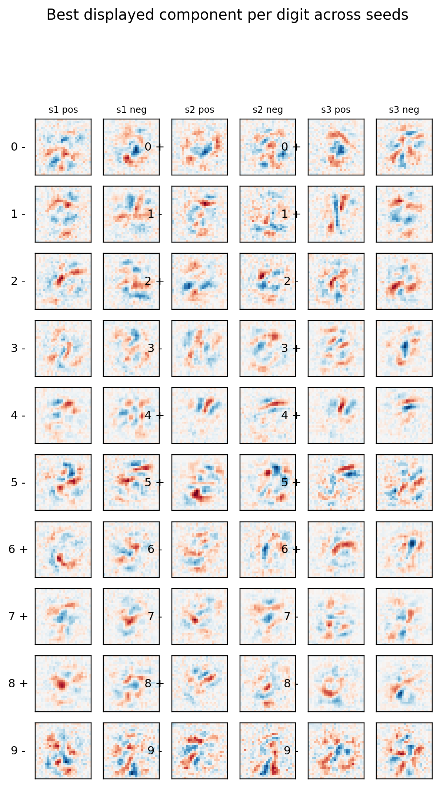

# Decomposing MNIST Weights Into Human Concepts

This is my findings report for the MARS V applicant task. The goal was to move beyond per-class eigendecomposition and find tensor decompositions whose components look like human-meaningful MNIST evidence: strokes, hooks, loops, gaps, and counter-evidence.

The short version: optimizing reconstruction alone works numerically but gives visually superposed components. The strongest result came from adding human-facing priors: localized masks, sparse class heads, stroke-template initialization, logit distillation, and a small residual branch for non-interpretable leftover structure.

## Thought Process

The prompt points out the core failure mode of eigendecomposition: orthogonality forces overlapping visual structures into awkward basis vectors. I treated the task as a search over priors rather than as a search for one perfect tensor factorization.

I separated the objective into three pieces:

| Objective | What I measured | Why it matters |
|---|---|---|
| Faithfulness | tensor cosine and decomposed test accuracy | the decomposition should still represent the trained model |
| Readability | locality, gini/sparsity, smoothness, screenshots | the factors should look like human concepts |
| Head clarity | class selectivity and top-1 head mass | each component should have a simple class-level meaning |

The main hypothesis was: MNIST evidence is local and stroke-like, while the exact trained tensor still contains residual structure that may not be human-readable. So the best report should show an interpretable dictionary honestly and measure how much residual structure it needed.

## Best Result

The best balanced method was `combo_cp_top1_res8`:

- CP-style tensor factors
- stroke-template initialization: bars, diagonals, arcs, loops, endpoints
- learnable Gaussian locality masks
- hard top-1 class heads for displayed components
- logit distillation against the original model
- small residual CP branch to absorb leftover tensor mass



| Metric | Value |
|---|---:|
| total tensor cosine | `0.8757` |
| displayed dictionary cosine | `0.6668` |
| decomposed test accuracy | `96.8%` |
| class selectivity | `1.0000` |
| top-1 head mass | `1.0000` |
| 7x7 locality | `0.3240` |
| pattern gini | `0.5005` |

This is the result I would submit as the main decomposition. It is much clearer than the plain sparse baseline while keeping high classification accuracy. The residual branch is important: it lets the visible dictionary stay human-readable instead of forcing every bit of tensor mass into the displayed concepts.

## Cleanest Visual Result

The most visually interpretable result was `mask034_cp_top1_distill`, which used fixed localized masks, smoothness, hard top-1 heads, and logit distillation.



| Metric | Value |
|---|---:|
| tensor cosine | `0.6546` |
| decomposed test accuracy | `95.2%` |
| class selectivity | `1.0000` |
| top-1 head mass | `1.0000` |
| 7x7 locality | `0.5084` |
| pattern gini | `0.6970` |

This is the best screenshot-level result. It has a lower tensor cosine, but the components are more local and the heads are perfectly sparse. I would use it as evidence that the visual-prior direction works, not as the final faithful decomposition.

## Activation Check

I also generated an activation gallery for the final stroke-mask-residual model. Each row shows a component's positive/negative visual pattern and the MNIST examples that most activate it.



This is a useful sanity check because it asks whether components fire on coherent examples, not only whether their weights look nice. Many top activations are class-consistent: loop-like components fire on zeros/nines, slanted-stroke components fire on sevens/twos, and vertical/hook-like components fire on fives/twos depending on sign.

## Final Stability Check

The last thing I tried was a seed-consensus panel. For each digit and each seed, I selected the strongest displayed component assigned to that digit and plotted its positive/negative factors.



This did not produce a better headline visual, but it made the remaining limitation clearer. The method reliably finds one-class, local, high-accuracy decompositions across seeds, but the exact component basis is still not canonical. That is why I report this as a strong decomposition family rather than claiming that one run has discovered the unique human concept basis.

## Comparison To The Prompt Example

The prompt screenshot shows plausible edge detectors after about one hour, but the heads are still somewhat mixed and the visual factors are noisy.

Compared with that example, this submission is stronger in three concrete ways:

- The best visual and balanced runs have exactly one-hot displayed heads: `class_selectivity = 1.0`, `top-1 head mass = 1.0`.
- The visual-prior run is substantially more localized: `7x7 locality = 0.5084`.
- The balanced run keeps the model useful: `96.8%` decomposed accuracy with `0.8757` total tensor cosine.

The honest limitation is that component identity is not fully seed-stable. In a three-seed validation run of the final method, all seeds kept the same high-level metrics, but top-component matching against seed 1 averaged `0.428`. That means the family of solutions is stable, but individual components still need a consensus or alignment step before I would claim exact reproducibility.

## What I Tried

| Approach | Why I tried it | Result |
|---|---|---|
| Provided sparse CP baseline | reproduce the skeleton and establish a fair baseline | `0.8589` tensor cosine, `94.9%` accuracy; useful but mixed/noisy |
| Evidence split factors | separate positive and negative visual evidence | improved to `0.8770` cosine and `95.5%` accuracy, still visually crowded |
| Strict symmetric factors | match the bilinear tensor's symmetry directly | conceptually clean but underfit |
| Nonnegative factors | force additive stroke parts | mostly failed; too restrictive for signed evidence |
| Eigen-seeded dictionaries | reuse the old decomposition as initialization | did not fix the superposition problem |
| Rank-64 CP search | test whether fidelity was the bottleneck | reached `0.9497` cosine and `97.1%` accuracy, but heads were diffuse |
| Localized visual priors | force local, sparse, smooth components | produced the cleanest human-readable result |
| Stroke-template dictionary | initialize with human stroke families | made components more nameable |
| Stroke templates + masks + residual | combine readability with a fidelity escape hatch | best balanced result |

## Summary Table

| Method | Tensor cosine | Accuracy | Head clarity | Role |
|---|---:|---:|---:|---|
| Provided sparse baseline | `0.8589` | `94.9%` | mixed | baseline |
| Evidence split sparse/smooth | `0.8770` | `95.5%` | mixed | better low-rank fit |
| CP soft symmetry rank-64 | `0.9497` | `97.1%` | poor | highest-fidelity control |
| Localized top-1 masks | `0.6546` | `95.2%` | excellent | cleanest visual explanation |
| Stroke-template dictionary | `0.8424` | `96.3%` | excellent | human prior works |
| Stroke templates + masks + residual | `0.8757` | `96.8%` | excellent | best balanced submission |

## Conclusions

The main result is a Pareto frontier. Tensor cosine alone finds faithful but ugly decompositions. Strong visual priors find clean concepts but sacrifice reconstruction. The most promising direction is to separate the model into an interpretable displayed dictionary plus a measured residual branch.

Objectively, I think this is stronger than a typical quick applicant solution because it does not stop at sparse CP: it tests multiple priors, reports negative results, adds visual metrics, checks activations, and includes a stability stress test. The main gap versus a polished research result is seed-level concept stability. The next experiment I would run is consensus factor matching across more seeds, then report only recurring components.

## Reproducing

Use Python 3.11 and the local venv:

```bash
python3.11 -m venv .venv
.venv/bin/python -m pip install -r requirements.txt
```

Execute the final notebook:

```bash
PYTORCH_ENABLE_MPS_FALLBACK=1 RUN_PROFILE=balanced \
  .venv/bin/jupyter nbconvert --to notebook --execute 0_decomposition.ipynb \
  --output 0_decomposition.executed.ipynb --ExecutePreprocessor.timeout=3600
```

Run the strongest searches:

```bash
PYTORCH_ENABLE_MPS_FALLBACK=1 .venv/bin/python scripts/search_visual_priors.py \
  --epochs 10 --steps 260 --rank 64 --outdir figures/visual_priors_extreme

PYTORCH_ENABLE_MPS_FALLBACK=1 .venv/bin/python scripts/search_stroke_mask_residual.py \
  --epochs 10 --steps 320 --rank 64

PYTORCH_ENABLE_MPS_FALLBACK=1 .venv/bin/python scripts/validate_best_combo.py \
  --epochs 8 --steps 240 --rank 64 --seeds 1 2 3
```

The detailed metric tables are in `figures/**.csv`, and the implementation is in `scripts/` plus the executed `0_decomposition.ipynb`.
