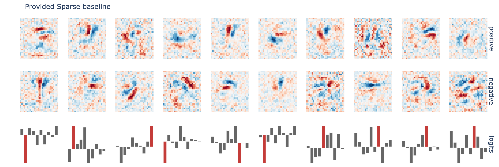
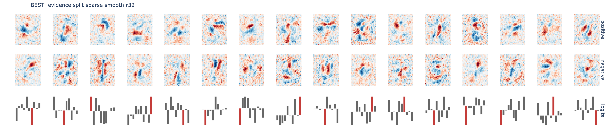
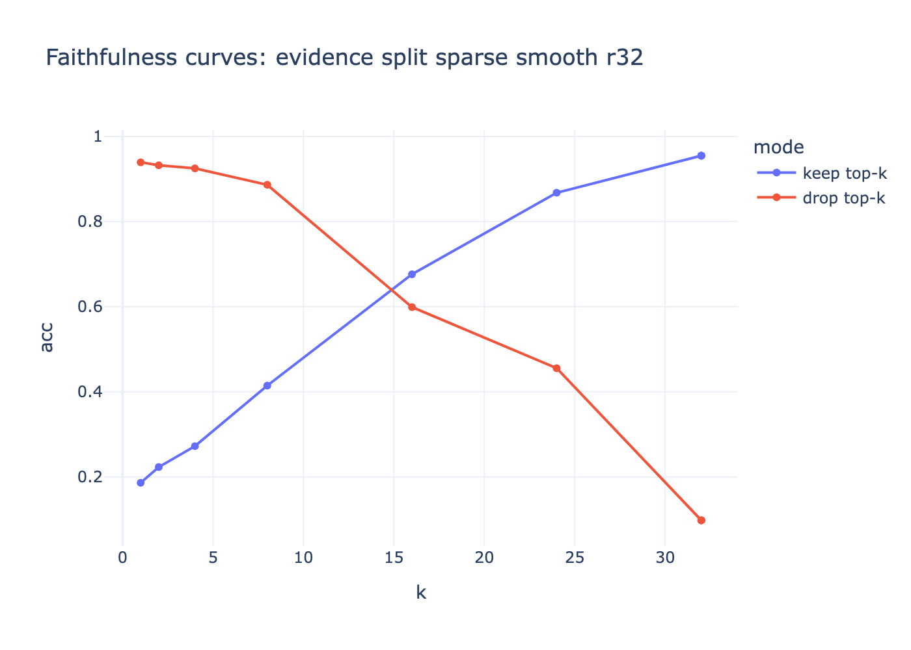
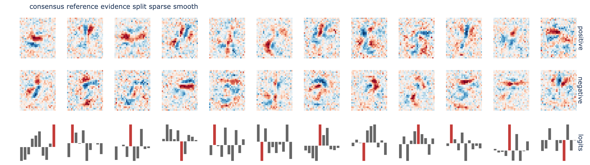

# Tensor Decomposition Experiments

This repo contains an extended solution notebook for the MARS V applicant task,
focused on decomposing bilinear MNIST weights into shared human-readable concepts.

Start with:

- `instructions.md` - original task prompt
- `0_introduction.ipynb` - bilinear interaction background
- `1_image.ipynb` - MNIST eigendecomposition tutorial
- `0_decomposition.ipynb` - final executed experiment notebook
- `decomposition_plan.md` - local research plan and experiment rationale
- `search_results_and_next_plan.md` - comparison to the prompt example and next experiments
- `image/` - minimal local implementation of the notebook helper package

## Main Idea

The original MNIST bilinear model computes:

```text
logit_c(x) = sum_ij B[c, i, j] x_i x_j
```

The final notebook compares several ways to approximate the full interaction
tensor with shared components:

```text
B[c, i, j] ~= sum_r L[i, r] R[j, r] D[c, r]
```

The goal is not only high tensor reconstruction. The target outcome is a short
dictionary of components that are faithful to the model, stable across seeds,
localized in image space, and easy to interpret as digit strokes or
counter-strokes.

## Variants Tried

The notebook currently runs these decomposition families:

- provided `image.sparse.Model` baseline
- CP factorization with a soft symmetry penalty
- strictly symmetric factors, `L = R`
- symmetric factors with sparsity, smoothness, class sparsity, and duplicate penalties
- direct positive/negative evidence split
- sparse/smooth evidence split
- nonnegative stroke-style evidence split
- eigenvector-seeded symmetric dictionary
- multi-seed consensus run for the strongest family

The checked-in run used the notebook's `balanced` profile: 4 MNIST training
epochs, rank-32 main decompositions, rank-48 nonnegative strokes, and shortened
optimization loops. Set `RUN_PROFILE=full` before executing the notebook to run
the longer rank-64/rank-96 version.

## Evaluation

Each variant is scored with:

- tensor cosine similarity to the original interaction tensor
- test accuracy of the decomposed model
- component sparsity / Gini score
- `7 x 7` patch locality
- class selectivity of output weights
- top-component spectrum concentration
- keep-only and drop-top-k faithfulness curves
- activation galleries for top components
- seed-consensus matching score

## Visual Summary

Running `0_decomposition.ipynb` exports interactive HTML figures and PNGs into
`figures/`. The PNGs below are the intended README snapshots.

### Baseline Components



### Best Components



### Faithfulness Curves



### Activation Gallery


### Consensus Reference



## Provisional Conclusions

The executed balanced run found:

- original bilinear MNIST model: `97.4%` test accuracy after 4 epochs
- best decomposition by the notebook score: `evidence split sparse smooth r32`
- best tensor cosine similarity: `0.8770`
- best decomposed-model test accuracy among custom decompositions: `96.1%` from
  plain `evidence split r32`
- provided sparse baseline: `0.8589` similarity and `94.9%` test accuracy
- nonnegative stroke factors failed in this parameterization: `0.0871`
  similarity and `43.2%` accuracy
- seed consensus for the sparse/smooth evidence split was moderate, around
  `0.54` component-match similarity against the reference seed

The main empirical takeaway is that the evidence-split parameterization was the
strongest local direction: it beat the provided sparse baseline on tensor
similarity while retaining useful accuracy. The sparse/smooth version traded a
small amount of accuracy for better class selectivity and became the selected
best candidate. The strictly symmetric variants were cleaner conceptually but
underfit. The nonnegative-only stroke attempt was a useful negative result.

Full metrics are in `figures/decomposition_results.csv`.

An additional 10-variant search is logged in `search_results_and_next_plan.md`.
The short version: the heavier rank-64 pass improved fidelity to about `0.95`
cosine similarity and `97%` decomposed accuracy, but the prompt example still
looks better by human readability. The next work should target raw-factor
smoothness, hard class-head sparsity, localized masks, and sparse rotations
after CP.

## Running

Use the local virtual environment or install the minimal requirements:

```bash
python3.11 -m venv .venv
.venv/bin/python -m pip install -r requirements.txt
PYTORCH_ENABLE_MPS_FALLBACK=1 RUN_PROFILE=balanced \
  .venv/bin/jupyter nbconvert --to notebook --execute 0_decomposition.ipynb \
  --output 0_decomposition.executed.ipynb --ExecutePreprocessor.timeout=3600
```

Optional PNG export requires Plotly's static image backend, usually:

```bash
pip install kaleido
```

Without `kaleido`, the notebook still writes interactive `.html` figures to
`figures/`.
