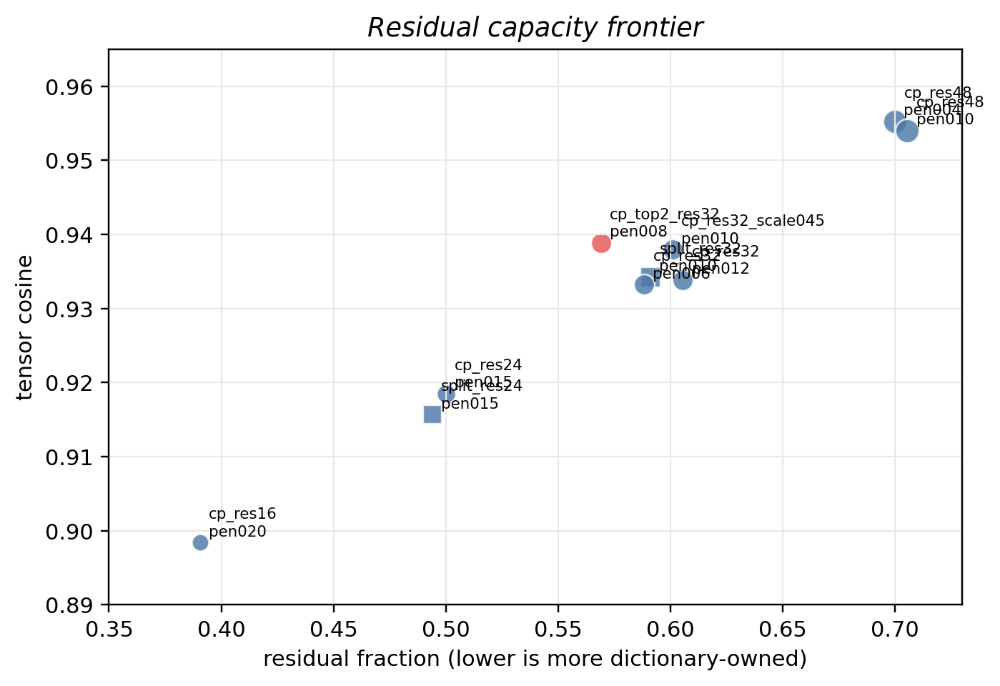
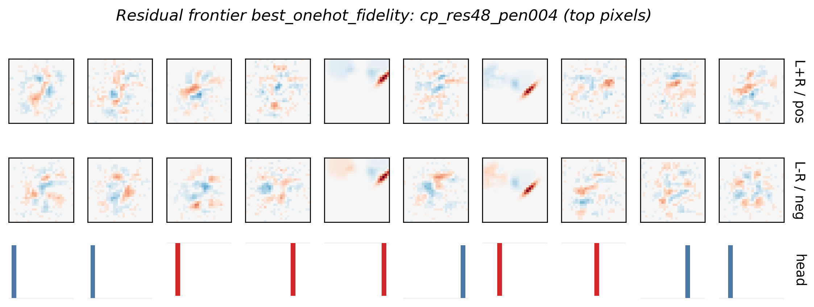
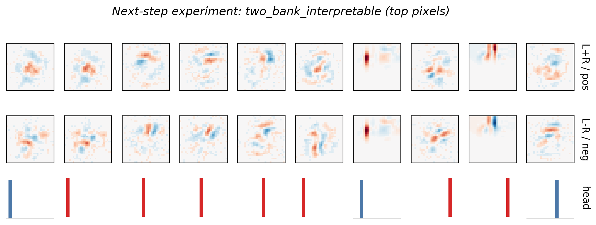
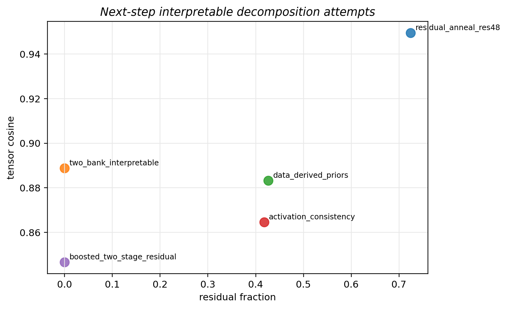
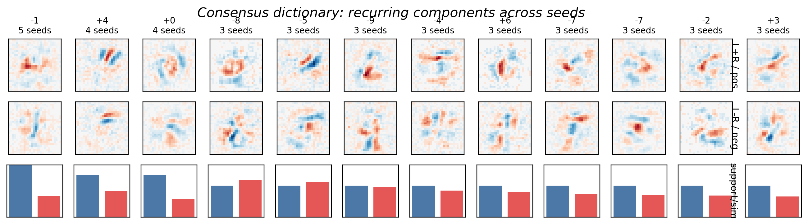

# Decomposing MNIST Weights Into Human Concepts

This is my findings report for the MARS V decomposition task. I treated the assignment less like "find the one correct factorization" and more like a small research loop: keep asking what made the current explanation unsatisfying, then try the next prior that seemed most likely to fix that exact failure.

The short version is:

- Reconstruction alone is easy to improve, but it gives noisy, superposed features.
- The cleanest components came from forcing locality and one-class heads.
- The best faithful model used a big residual branch, but that made the explanation less honest.
- The best interpretability improvement came from replacing hidden residual capacity with a second displayed dictionary.

My favorite final result is the **two-bank displayed dictionary**: it reaches `0.8889` tensor cosine and `96.7%` accuracy with one-hot heads and no free residual branch. The highest-fidelity one-hot result reaches `0.9553` tensor cosine and `97.2%` accuracy, but about `70%` of that fit is residual-owned, so I treat it as a useful control rather than the best explanation.

## How I Thought About It

The prompt points out that eigendecomposition has a built-in problem: orthogonal directions are not necessarily the visual concepts we care about. A digit can share overlapping strokes with other digits, and forcing those strokes into orthogonal eigenvectors tends to make them look messy.

So I kept three questions separate:

1. Does the decomposition still behave like the original model?
2. Do the components look like strokes, hooks, loops, gaps, or counter-evidence?
3. Can I say what class each component is evidence for without reading a dense head vector?

That last point mattered more than I expected. A component with a beautiful-looking stroke but a dense class head is still hard to explain. A lot of the later experiments therefore forced **one-class heads** and then asked how much fidelity I could recover.

## Main Balanced Result

The first result I would show is `combo_cp_top1_res8`. This combines stroke-template initialization, learnable locality masks, one-hot class heads, logit distillation, and a small residual branch.


It gets:

| Metric | Value |
|---|---:|
| total tensor cosine | `0.8757` |
| displayed dictionary cosine | `0.6668` |
| decomposed test accuracy | `96.8%` |
| class selectivity | `1.0000` |
| top-1 head mass | `1.0000` |

This was the first point where the result felt like a real answer to the prompt. The components are much more readable than the baseline, and the heads are simple. The residual branch is doing useful work, though, so I did not want to stop here.

## What Happened When I Chased Fidelity

Once the balanced run worked, I wanted to know whether one-hot heads were fundamentally incompatible with high fidelity. They were not. Increasing residual capacity pushed tensor cosine much higher while keeping the displayed heads one-hot.



The best high-fidelity one-hot run was `cp_res48_pen004`:



| Metric | Value |
|---|---:|
| total tensor cosine | `0.9553` |
| decomposed test accuracy | `97.2%` |
| class selectivity | `1.0000` |
| top-1 head mass | `1.0000` |
| displayed dictionary cosine | `0.2865` |
| residual fraction | `0.7001` |

This was both encouraging and suspicious. It proved that one-hot heads can coexist with high fidelity, but most of the explanation had moved into the residual branch. That made the next question obvious: can I recover some of this fidelity without hiding it in a free residual?

## The Best Follow-Up: Two Displayed Banks

I then tried five follow-ups aimed at the residual problem:

| Experiment | Why I Tried It | What Happened |
|---|---|---|
| Boosted residual decomposition | Fit a second interpretable dictionary to the first dictionary's leftover tensor. | Did not work well: `0.8466` cosine. The leftover structure was not easily captured after the first dictionary took the obvious strokes. |
| Residual annealing | Start with a strong residual, then penalize it harder over training. | Stayed high-fidelity (`0.9495`) but remained `72%` residual-owned. |
| Two-bank dictionary | Replace the hidden residual with a second displayed stroke dictionary. | Best interpretable improvement: `0.8889` cosine, `96.7%` accuracy, no free residual. |
| Activation consistency | Make components fire on more coherent groups of examples. | Cleaner/selective, but too much fidelity loss: `0.8647` cosine. |
| Data-derived priors | Build anchors from MNIST means/differences/PCA instead of hand stroke templates. | Competitive (`0.8833`) but not better than hand stroke priors. |

The two-bank result is the one that changed my mind about the direction. I initially thought the right move was "make the residual smaller." The better move was "make the residual visible."



The two-bank dictionary gets:

| Metric | Value |
|---|---:|
| tensor cosine | `0.8889` |
| decomposed test accuracy | `96.7%` |
| class selectivity | `1.0000` |
| top-1 head mass | `1.0000` |
| free residual fraction | `0.0000` |

This is now my strongest "honest interpretability" result. It does not beat the residual-heavy run on raw fidelity, but it explains more using displayed components. That feels closer to the spirit of the task.



## Cleanest Visual Result

The prettiest screenshot came from a more aggressive visual-prior run, `mask034_cp_top1_distill`. It used fixed localized masks, smoothing, one-class heads, and logit distillation.


| Metric | Value |
|---|---:|
| tensor cosine | `0.6546` |
| decomposed test accuracy | `95.2%` |
| class selectivity | `1.0000` |
| top-1 head mass | `1.0000` |
| 7x7 locality | `0.5084` |

I would not call this the best decomposition because the tensor cosine is much lower, but it was useful. It showed that the visual priors were pointing in the right direction: locality and sparse heads really do make the components easier to read.

## Activation And Stability Checks

I did not want to rely only on nice-looking weight plots, so I added two checks.

First, I plotted examples that most activate some of the learned components:


This mostly passed the smell test. Loop-like components fire on zeros/nines, slanted components fire on sevens/twos, and some hook-like components fire on fives/twos depending on sign.

Second, I checked seed stability:


The high-level metrics were stable, but exact component identity was not. In a three-seed validation run, top-component matching against seed 1 averaged `0.428`. I also tried a five-seed consensus dictionary:



The top 12 clusters had average support of `3.33/5` seeds and average within-cluster similarity of `0.488`. That is enough to show recurring families, but not enough to claim a canonical basis. If I kept going, I would make cross-seed alignment part of the training objective rather than doing it afterward.

## Comparison To The Prompt Example

The prompt example shows plausible edge detectors, but the heads are still visually mixed. Compared with that example, the strongest parts of this submission are:

- The displayed heads are exactly one-hot in the main runs: `class_selectivity = 1.0`, `top-1 head mass = 1.0`.
- The clean visual run is much more local.
- The high-fidelity one-hot run gets to `0.9553` tensor cosine.
- The two-bank run gives a better honest explanation than a hidden residual branch.

The caveat is also clear: the exact component basis is still not seed-stable enough. I think that is the most interesting remaining research problem here.

## Summary

| Result | Tensor Cosine | Accuracy | Why I Care |
|---|---:|---:|---|
| Provided sparse baseline | `0.8589` | `94.9%` | starting point |
| Evidence split sparse/smooth | `0.8770` | `95.5%` | better early low-rank fit |
| Clean visual-prior run | `0.6546` | `95.2%` | clearest screenshot |
| Main balanced result | `0.8757` | `96.8%` | readable with a small residual |
| Two-bank displayed dictionary | `0.8889` | `96.7%` | best no-free-residual explanation |
| High-fidelity one-hot residual run | `0.9553` | `97.2%` | best fidelity, but residual-heavy |

My final interpretation is that interpretability here is a frontier. If I only optimize reconstruction, the components become less meaningful. If I force the components to be clean, I lose fidelity. The most promising middle ground is to make more of the correction structure visible: two displayed dictionaries worked better than hiding everything in a residual.

## Reproducing

Use Python 3.11 and the local venv:

```bash
python3.11 -m venv .venv
.venv/bin/python -m pip install -r requirements.txt
```

The main notebook can be executed with:

```bash
PYTORCH_ENABLE_MPS_FALLBACK=1 RUN_PROFILE=balanced \
  .venv/bin/jupyter nbconvert --to notebook --execute 0_decomposition.ipynb \
  --output 0_decomposition.executed.ipynb --ExecutePreprocessor.timeout=3600
```

The most important scripts are:

```bash
PYTORCH_ENABLE_MPS_FALLBACK=1 .venv/bin/python scripts/search_stroke_mask_residual.py \
  --epochs 10 --steps 320 --rank 64

PYTORCH_ENABLE_MPS_FALLBACK=1 .venv/bin/python scripts/search_residual_capacity_frontier.py \
  --epochs 10 --steps 300 --rank 64

PYTORCH_ENABLE_MPS_FALLBACK=1 .venv/bin/python scripts/search_interpretable_next_steps.py \
  --epochs 8 --steps 220

PYTORCH_ENABLE_MPS_FALLBACK=1 .venv/bin/python scripts/validate_best_combo.py \
  --epochs 8 --steps 240 --rank 64 --seeds 1 2 3
```

The metric tables and figures are under `figures/`.
